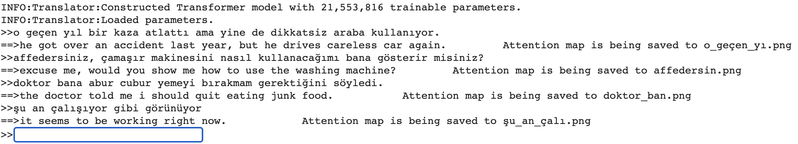

# Neural Machine Translation
This repository contains sequence-to-sequence NMT model implementations along with supplementary scripts to train BPE tokenizers, evaluate NMT models with BLEU score. It currently contains an implementation of the Transformer model. RNN + Attention will be included soon.

## Training
You can train a custom Transformer model with following command. Play with the hyper-parameters to see how they effect the model performance.
```bash
# Extract the provided dataset
unzip data/eng-tur-dataset.zip -d data/
cd src
python -m nmt train --train_dataset ../data/eng-tur-train.csv \
                     --eval_dataset ../data/eng-tur-val.csv \
                     --test_dataset ../data/eng-tur-test.csv \
                     --src_vocab ../data/tr_sp.model \
                     --trg_vocab ../data/en_sp.model \
                     --n_epochs 15 \
                     --hid_dims 256 \
                     --enc_layers 4 \
                     --dec_layers 4 \
                     --enc_heads 8 \
                     --dec_heads 8 \
                     --enc_pf_dim 1024 \
                     --dec_pf_dim 1024 \
                     --max_len 172 \
                     --lr 0.0005 \
                     --enc_dropout 0.35 \
                     --dec_dropout 0.35 \
                     --wd_rate 0.0001 \
                     --clip 1 \
                     --batch_sz 128 \
                     --save_model_path transformer_tr_en.pt
```

## Evaluation
Run the following command to evaluate a trained Transformer model which will print its **loss, perplexity**, and **BLEU score**.  Note that we need the hyper-parameters to construct the model first. So make sure that they match with the actual hyper-parameters.
```bash
python -m nmt evaluate  --test_dataset ../data/test.csv \
                        --src_vocab ../data/tr_sp.model \
                        --trg_vocab ../data/en_sp.model \
                        --model_path transformer_tr_en.pt \
                        --hid_dims 256 \
                        --enc_layers 4 \
                        --dec_layers 4 \
                        --enc_heads 8 \
                        --dec_heads 8 \
                        --enc_pf_dim 1024 \
                        --dec_pf_dim 1024 \
                        --enc_dropout 0.35 \
                        --dec_dropout 0.35 \
                        --batch_sz 128
```

## Translation
You can interactively translate sentences via a terminal. Simply type your input sentence to the prompt and it will get translated. The attention map of the translation will also be saved.
```bash
python -m nmt translate --src_vocab ../data/tr_sp.model \
                        --trg_vocab ../data/en_sp.model \
                        --model_path transformer_tr_en.pt \
                        --hid_dims 256 \
                        --enc_layers 4 \
                        --dec_layers 4 \
                        --enc_heads 8 \
                        --dec_heads 8 \
                        --enc_pf_dim 1024 \
                        --dec_pf_dim 1024 \
                        --enc_dropout 0.35 \
                        --dec_dropout 0.35 \
```

Here is what you should see after the translation script runs successfullyŞ


Attention map of the translation is saved to the same folder as follows:


### Train custom BPE tokenizers
In order to train a custom BPE model, you can run the *train_bpe* script by issuing the following command. sentences.tsv contain a tsv file with *en - tr* sentence pairs.
```
python data/train_bpe.py --file_path sentences.tsv
```